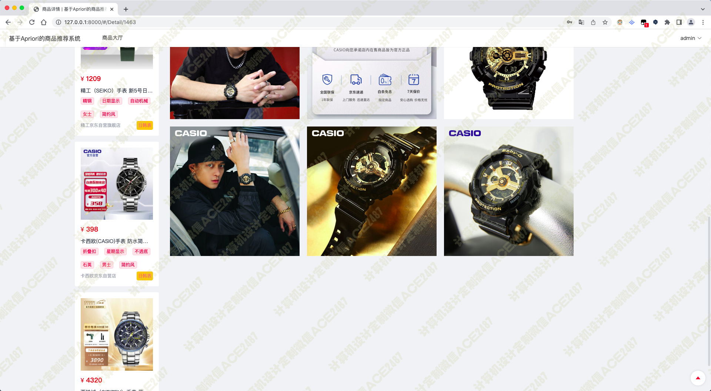
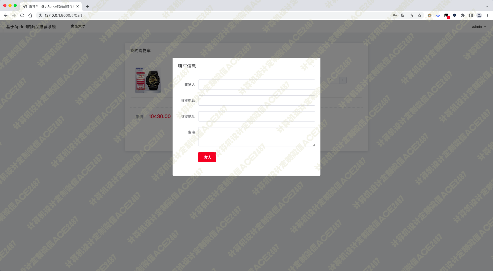

# 018 基于apriori关联规则的商品推荐系统-设计源码展示

> **代码有偿获取 可接受定制 微信联系方式: csbysj2020 或 ACE2487，备注(BS)**

> 

> 

## 介绍

本系统通过scrapy爬虫框架抓取京东上的商品，存入本地数据库，用Django框架搭建后端用于提供数据，Vue搭建前端用于展示数据

功能有：

1. 商品检索
2. 商品详情
3. 加入购物车
4. 结算购买
5. 查看历史订单
6. 个人中心
7. 基于用户历史浏览来推荐商品
8. 当用户访问商品详情时，基于apriori算法推荐关联商品

系统的基本流程如下：

1. 数据准备。首先需要收集用户的购买数据，并对其进行预处理，去除噪音和不相关的数据。
2. Apriori算法分析。然后使用 Apriori关联规则分析工具，挖掘用户购买记录中的关联规则，并生成推荐列表。
3. 动态调整。在推荐过程中，系统会根据实际情况动态调整推荐列表，以适应用户需求。
4. 显示推荐列表。最终，系统会根据用户需求和偏好将推荐列表展示给用户。
   
系统使用了 Django和 Vue. js技术来实现，同时结合了 apriori关联规则分析工具来提高推荐的准确性和效率。

## 技术栈

python django vue apriori算法 scrapy 关联规则算法 商品检索 商品详情 加入购物车 结算购买 查看历史订单 个人中心 基于用户历史浏览来推荐商品 当用户访问商品详情时，基于apriori算法推荐关联商品

## 视频

> **点击查看 \>\>\> [https://www.bilibili.com/video/BV1Ng4y1t7Tg/](https://www.bilibili.com/video/BV1Ng4y1t7Tg/)**

## 截图

